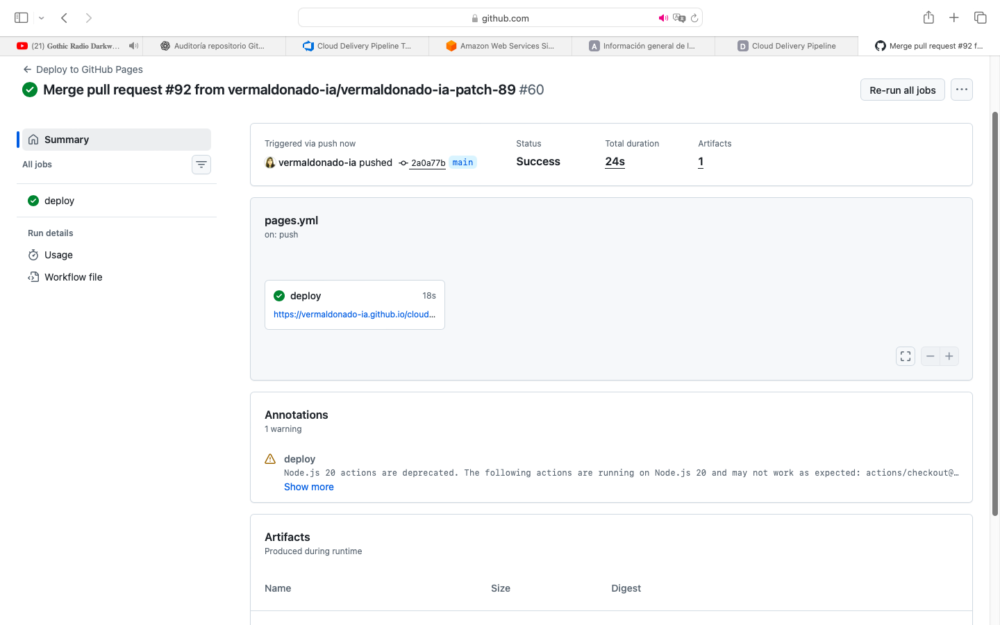
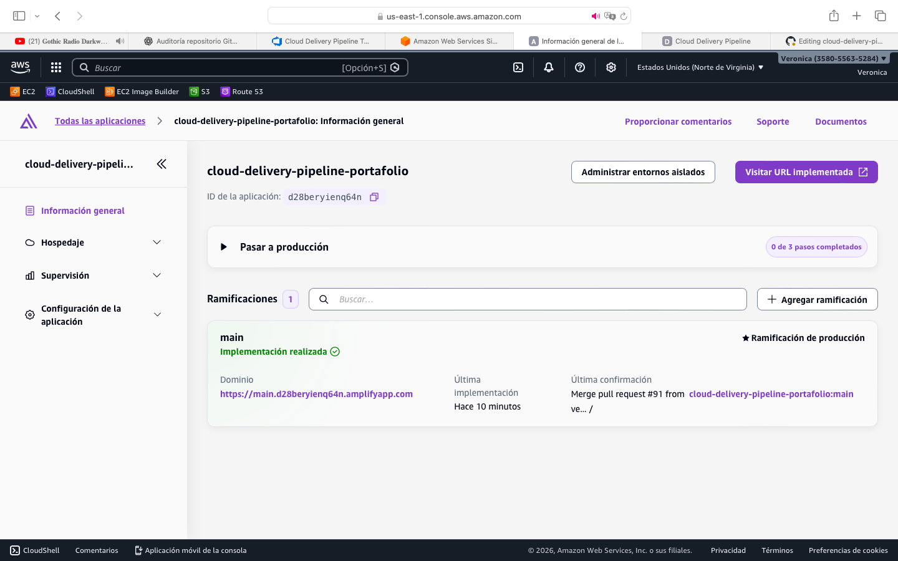

# 🚀 Cloud Delivery Pipeline Portafolio

💡 Caso práctico de implementación de un pipeline DevOps real, donde se integran prácticas de calidad, automatización y despliegue continuo en la nube, simulando un flujo de entrega utilizado en entornos productivos.

---

## 🌐 Producción

👉 URL del sitio desplegado:
https://TU-URL-AMPLIFY

El despliegue continuo se realiza automáticamente en AWS Amplify, generando un entorno accesible públicamente tras cada cambio en la rama principal.

---

## 🎯 Objetivo

Implementar un pipeline que permita:

* Detectar errores de forma temprana (Shift Left)
* Asegurar calidad del código antes del merge
* Validar cobertura de pruebas
* Controlar cambios hacia producción
* Automatizar el despliegue en la nube

---

## 💼 Valor entregado

* Reducción de errores en etapas tempranas mediante CI
* Control de calidad automatizado antes del despliegue
* Estandarización del flujo de entrega
* Simulación de un entorno real de producción

---

## 📐 Arquitectura del flujo

Dev → Pull Request → CI (Tests + Coverage) → Quality Gate → Merge → CD (AWS Amplify)

---

## ⚙️ Arquitectura del Pipeline

Flujo implementado:

Pull Request / Push
↓
CI Pipeline (GitHub Actions)
↓
Code Quality (Quality Gate: pytest + coverage + flake8)
↓
Merge controlado a main
↓
CD Automático (AWS Amplify - Deploy real)

---

## 🔄 Integración Continua (CI)

El pipeline ejecuta automáticamente:

* Instalación de dependencias
* Configuración de entorno Python
* Ejecución de pruebas con pytest
* Medición de cobertura con pytest-cov
* Análisis de calidad con flake8

Esto permite validar cada cambio antes de integrarlo a la rama principal.

---

## 🛡️ Code Quality - Quality Gate

Se implementa un Quality Gate práctico inspirado en herramientas como:

* SonarQube
* Azure DevOps Quality Gates

---

## 🔍 Evidencia real del flujo CI/CD

A continuación se muestra la ejecución real del pipeline y el despliegue en la nube:

---

### ⚙️ GitHub Actions – Pipeline ejecutado

✔ Ejecución automática tras merge en `main`
✔ Validación de CI completada exitosamente
✔ Despliegue a GitHub Pages (evidencia visual del pipeline)

---

### ☁️ AWS Amplify – Despliegue en producción

✔ Deploy automático configurado
✔ Aplicación publicada en entorno cloud
✔ URL productiva generada

---

💡 Esto demuestra la integración completa entre validación técnica (CI), control de calidad (Quality Gate) y despliegue continuo (CD) en la nube.

---

### 🔍 Validaciones aplicadas:

* ✔ Tests deben pasar
* ✔ Coverage mínimo: 80%
* ✔ Código sin errores de linting

Si alguna condición falla:

⛔ El pipeline se detiene
⛔ No se permite avanzar en el flujo

---

## 🧪 Evidencia del Pipeline

### ✅ Ejecución exitosa

### ❌ Fallo por pruebas

### ⚠️ Fallo por cobertura

---

## ☁️ Despliegue Continuo (CD)

El despliegue se realiza automáticamente en AWS Amplify, actuando como el único entorno de entrega continua del proyecto.

* Se activa al hacer merge en `main`
* Publica el sitio en la nube
* Genera una URL accesible públicamente

Este enfoque permite simular un entorno real de producción, alineado a prácticas utilizadas en arquitecturas cloud modernas.

---

## 📊 Gestión del Delivery con Azure DevOps

Se incorpora trazabilidad del trabajo mediante:

* Backlog priorizado
* User Stories
* Story Points
* Tablero Kanban

👉 Ver detalle: [boards_evidencia.md](./azure_devops/boards_evidencia.md)

Esto permite mantener trazabilidad entre desarrollo y entrega.

---

## ⚠️ Alcance del proyecto

* CI → Implementación real
* Quality Gate → Implementación práctica (simulación de herramientas enterprise)
* CD → Implementación real en AWS Amplify
* Gestión → Simulación de entorno organizacional con Azure DevOps

---

## 🧠 Enfoque de Delivery

Este proyecto no se centra únicamente en la automatización técnica, sino en cómo estructurar un flujo de entrega que:

* Minimice riesgos antes del despliegue
* Asegure calidad continua
* Permita escalar el modelo a equipos reales
* Integre prácticas DevOps con gestión ágil

---

## 📚 Aprendizajes clave

* Importancia del control de calidad antes del merge
* Implementación de métricas como coverage en CI
* Automatización del flujo de entrega
* Integración entre prácticas DevOps y gestión ágil

---

## 🧱 Estructura del Repositorio

* `app_demo/` → Aplicación base para pruebas
* `sonarqube/` → Implementación de Quality Gate práctico
* `.github/workflows/` → Pipeline CI/CD
* `docs/` → Evidencias del pipeline
* `azure_devops/` → Gestión del trabajo

---

## 👩‍💼 Rol en este proyecto

En este proyecto asumí un rol integral de Delivery, donde:

* Diseñé el flujo de CI/CD
* Definí reglas de Quality Gate (coverage, linting)
* Implementé automatización con GitHub Actions
* Simulé control de calidad tipo SonarQube
* Integré trazabilidad de trabajo con Azure DevOps
* Implementé despliegue continuo en AWS Amplify

El foco fue demostrar cómo estructurar un flujo de entrega moderno, alineado a prácticas DevOps.

---

## 🚀 Conclusión

Este proyecto refleja la capacidad de diseñar e implementar un flujo de entrega moderno, integrando automatización, calidad y despliegue continuo, alineado a prácticas utilizadas en organizaciones que operan bajo modelos DevOps.

---

## 🔗 Enlaces

👉 Repositorio GitHub
👉 Pipeline CI (GitHub Actions)
👉 Sitio en producción (AWS Amplify)
