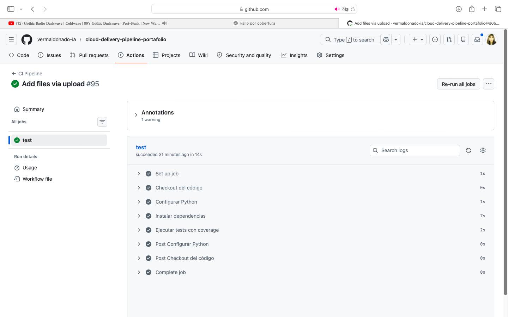
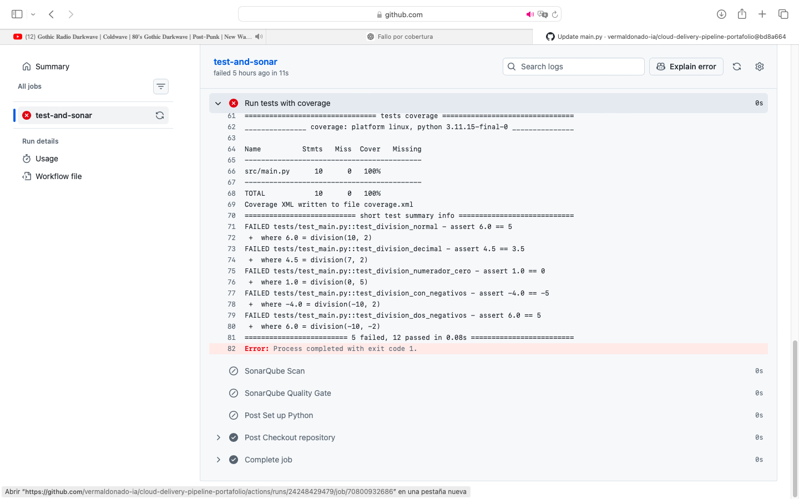
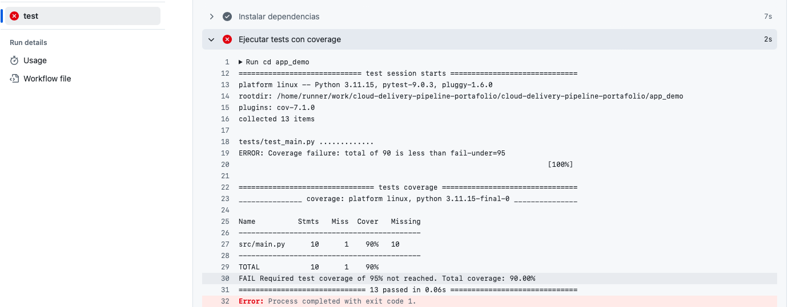
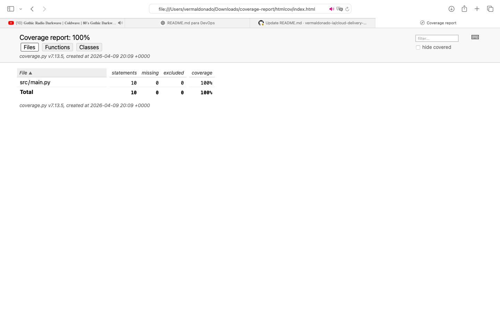

# 🚀 Cloud Delivery Pipeline Portafolio

Repositorio que demuestra la implementación de un pipeline DevOps completo, integrando prácticas de Integración Continua (CI), control de calidad (Quality Gate), gestión de Pull Request y despliegue continuo (CD) en AWS Amplify.

---

## 🌐 Aplicación en Producción

👉 https://main.d28beryienq64n.amplifyapp.com

---

## 🎯 Objetivo

Implementar un flujo de entrega moderno que permita:

* Detectar errores de forma temprana (Shift Left)
* Asegurar calidad del código antes del merge
* Validar cobertura de pruebas
* Controlar cambios hacia la rama principal
* Automatizar el despliegue en un entorno productivo

---

## ⚙️ Arquitectura del Pipeline

Pull Request / Push
↓
CI (Tests + Coverage)
↓
Code Quality (Quality Gate)
↓
Merge controlado a main
↓
CD automático en AWS Amplify

---

## 🔄 Flujo de ejecución

1. Se crea un Pull Request hacia la rama principal
2. Se ejecuta automáticamente el pipeline de CI
3. Se validan pruebas y cobertura
4. Se ejecuta el Quality Gate
5. Si todo es exitoso, se permite el merge
6. Se activa el despliegue automático en AWS Amplify

---

## 🔄 Integración Continua (CI)

El pipeline ejecuta automáticamente:

* Instalación de dependencias
* Configuración de entorno Python
* Ejecución de pruebas con pytest
* Medición de cobertura con pytest-cov

Esto permite validar cada cambio antes de integrarlo a la rama principal.

---

## 🧪 Evidencia del Pipeline

### ✔️ Ejecución exitosa

### ❌ Falla por pruebas

Se provocó un error intencional para validar detección de fallas reales.

### 📊 Falla por cobertura

Se configuró una cobertura mínima para validar el control del pipeline.

### 📈 Resultado de cobertura

---

## 🛡️ Code Quality (Quality Gate)

Se implementa un control de calidad basado en:

* flake8 para análisis estático
* validación de coverage mínimo
* ejecución automática en CI

Este módulo actúa como un Quality Gate, bloqueando el pipeline si no se cumplen estándares mínimos.

Más detalle en: `sonarqube/README.md`

---

## 🔐 Control de Pull Request (PR)

Se aplican buenas prácticas DevOps:

* Validación automática en cada PR
* Bloqueo de merge si el pipeline falla
* Protección de la rama `main`

Esto asegura que solo código validado avance en el flujo de entrega.

---

## 🚀 Continuous Deployment (CD)

El proyecto implementa despliegue continuo real en AWS Amplify:

* Conexión directa con repositorio GitHub
* Deploy automático en cada push a `main`
* Publicación en entorno productivo
* URL accesible públicamente

Flujo automatizado:
Push → Build → Deploy → Producción

---

## 🧠 Enfoque DevOps aplicado

Este proyecto demuestra:

* Automatización de validaciones
* Shift Left Testing
* Control de calidad integrado
* Flujo CI/CD completo
* Gestión de fallos en pipeline
* Despliegue continuo en cloud

---

## 🛠️ Tecnologías utilizadas

* Python 3.11
* pytest
* pytest-cov
* flake8
* GitHub Actions
* AWS Amplify
* HTML / CSS

---

## 📈 Valor del proyecto

Este enfoque permite:

* Reducir defectos en producción
* Asegurar calidad continua
* Automatizar el ciclo de entrega
* Mantener trazabilidad end-to-end
* Implementar despliegue real en cloud

---

## 📌 Estado del proyecto

* CI implementado
* Quality Gate implementado
* PR controlado
* CD automático en AWS Amplify
* Deploy productivo activo

---

## 🚀 Próximos pasos

* Integrar análisis avanzado con SonarQube real
* Agregar métricas visuales del pipeline
* Incorporar monitoreo o alertas
* Evolucionar a backend o microservicios

---

## 🔗 Enlaces

Repositorio: https://github.com/vermaldonado-ia/cloud-delivery-pipeline-portafolio
Pipeline: https://github.com/vermaldonado-ia/cloud-delivery-pipeline-portafolio/actions
Aplicación: https://main.d28beryjenq64n.amplifyapp.com

---

## 👩‍💻 Autora

**Verónica Maldonado**
Ingeniera Civil Informática
Project Manager | Agile | Cloud | DevOps
