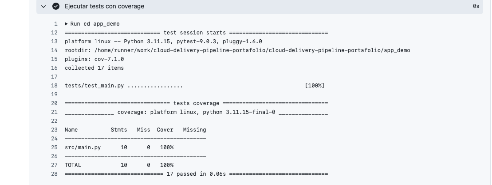
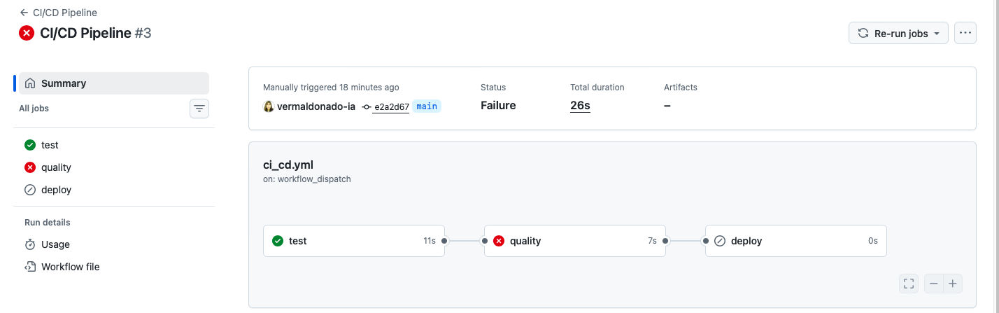

# 🚀 Cloud Delivery Pipeline Portafolio


Repositorio que demuestra la implementación de un **pipeline CI/CD completo** utilizando **GitHub Actions**, incorporando validación automática de calidad, cobertura de pruebas y despliegue real mediante **GitHub Pages**.

---

## 🎯 Objetivo

Construir un pipeline que permita:

* Validar automáticamente la calidad del código
* Detectar errores de forma temprana
* Medir cobertura de pruebas de forma automatizada
* Bloquear despliegues si no se cumplen estándares
* Ejecutar un flujo CI/CD real utilizado en entornos profesionales

---

## ⚙️ Arquitectura del Pipeline

```text
Push
 ↓
CI (Tests + Coverage)
 ↓
Quality Gate (flake8)
 ↓
CD (Deploy en GitHub Pages)
```

---

## 🔹 1. Integración Continua (CI)

* Instalación de dependencias
* Ejecución de pruebas automatizadas con `pytest`
* Medición de cobertura con `pytest-cov`

---

## 📊 Test Coverage

El pipeline incorpora medición real de cobertura de pruebas.

### 🎯 Resultado

* Coverage total: **100%**

#### 📸 Evidencia



---

## 🔹 2. Code Quality - Quality Gate Simulado

Se implementa un **Quality Gate** utilizando `flake8`.

### 🔍 Validaciones

* Errores críticos de código
* Variables no definidas
* Complejidad y mantenibilidad
* Estándares de formato

👉 Si falla calidad, el pipeline se detiene.

---

## 🚫 Quality Gate en acción

### ❌ Caso: error de calidad

Se introduce un error intencional:

* El pipeline falla
* El deploy se bloquea

#### 📸 Evidencia



---

### ✅ Caso: código correcto

* Tests pasan
* Quality Gate aprueba
* Deploy se ejecuta

#### 📸 Evidencia


---

## 🔹 3. Continuous Deployment (CD)

El pipeline ejecuta un **deploy real** mediante GitHub Pages.

### ✔ Qué hace el deploy

* Genera un sitio HTML automáticamente
* Publica el resultado del pipeline
* Entrega una URL accesible públicamente

👉 Esto convierte el CD en un despliegue real, no solo simulado.

---

## 🎯 Resultado

El pipeline implementa control completo de flujo:

* Si falla calidad → ❌ no hay deploy
* Si pasa todo → ✅ deploy automático

---

## 🧠 Enfoque técnico

Este proyecto replica prácticas reales:

* Integración continua automatizada
* Control de calidad antes del despliegue
* Uso de métricas (coverage)
* Despliegue automatizado

El Quality Gate está implementado con `flake8`, simulando el rol de herramientas como **SonarQube**.

---

## 🚀 Valor del Portafolio

Demuestra:

* CI/CD con GitHub Actions
* Coverage real con pytest-cov
* Quality Gate automatizado
* Deploy real con GitHub Pages
* Control de flujo entre etapas (`needs`)

---

## 📁 Estructura

```text
cloud-delivery-pipeline-portafolio/
├── .github/workflows/
├── app_demo/
├── docs/
│   ├── test-coverage.png
│   ├── quality-gate-fail.png
│   └── pipeline-success.png
├── sonarqube/
│   └── README.md
└── README.md
```

---

## 🧩 Próximos pasos

* Integración con SonarQube real
* Umbral mínimo de coverage
* Deploy a AWS / Azure
* Pipeline multi-entorno

---

## 🏁 Conclusión

Se implementa un pipeline CI/CD funcional con testing, coverage, control de calidad y despliegue real, demostrando prácticas modernas de DevOps aplicadas a un entorno de portafolio.

---
