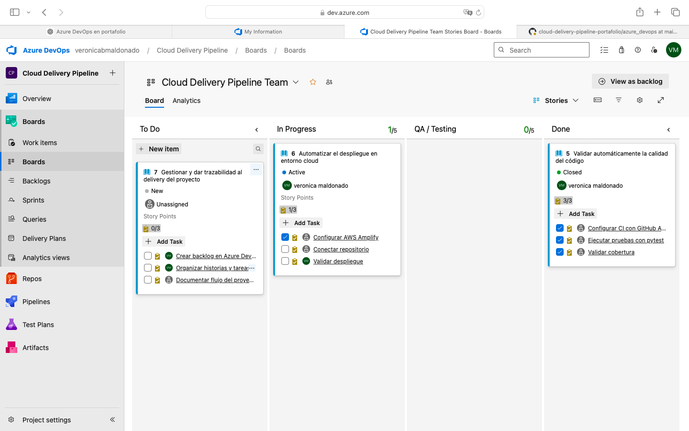
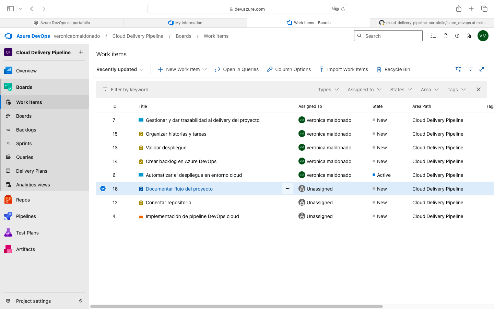
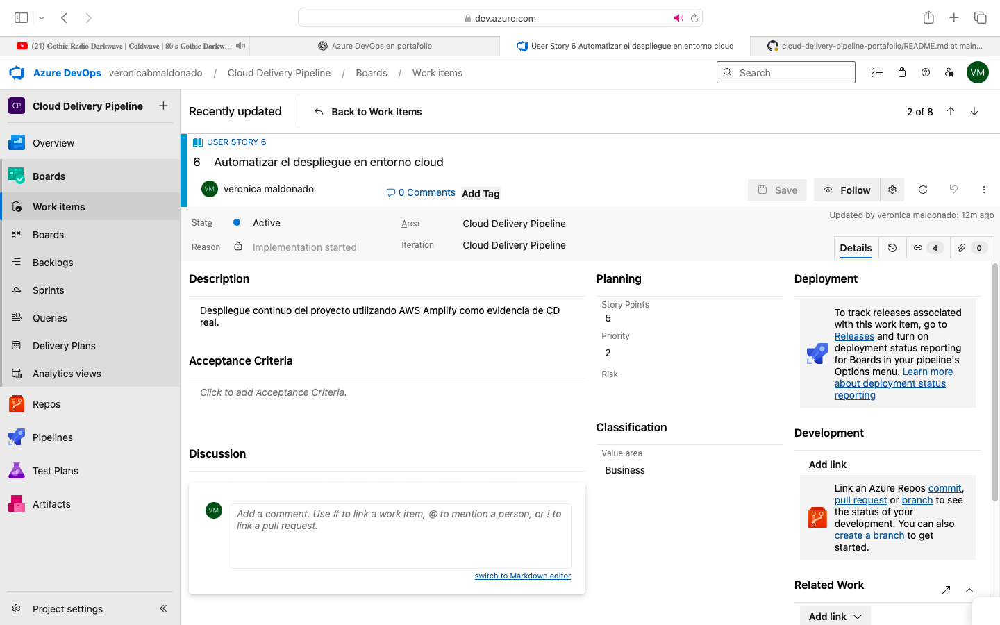

# 🚀 Cloud Delivery Pipeline Portafolio

🔗 **Producción:** https://main.d28beryienq64n.amplifyapp.com
🔗 **Repositorio:** https://github.com/vermaldonado-ia/cloud-delivery-pipeline-portafolio
🔗 **CI Pipeline:** https://github.com/vermaldonado-ia/cloud-delivery-pipeline-portafolio/actions

---

## 💡 Descripción

Este proyecto implementa un pipeline DevOps completo, integrando prácticas de Integración Continua (CI), control de calidad y despliegue continuo (CD) real en la nube.

El enfoque está orientado a simular un flujo de entrega utilizado en entornos empresariales, asegurando calidad, trazabilidad y automatización.

---

## 🎯 Objetivo

* Detectar errores de forma temprana (Shift Left)
* Asegurar calidad del código antes del merge
* Validar cobertura de pruebas
* Controlar cambios hacia producción
* Automatizar despliegues en la nube

---

## ⚙️ Arquitectura del Pipeline

Pull Request / Push
↓
CI Pipeline (GitHub Actions)
↓
Code Quality (Quality Gate: pytest + coverage + flake8)
↓
Merge controlado a main
↓
CD Automático (AWS Amplify - Deploy real)

El despliegue continuo se realiza automáticamente en AWS Amplify, generando un entorno de producción accesible públicamente.

---

## 📊 Gestión del Delivery con Azure DevOps

Para complementar el flujo técnico del pipeline, se incorporó Azure DevOps como herramienta de gestión del trabajo, permitiendo organizar el backlog, dar trazabilidad a los requerimientos y visualizar el avance del proyecto.

### 🎯 Objetivo

* Gestionar historias de usuario y tareas asociadas
* Visualizar el flujo de trabajo mediante tablero Kanban
* Mantener trazabilidad entre requerimientos y ejecución
* Simular un entorno de delivery real en contexto empresarial

---

### 🧩 Estructura de trabajo

El proyecto fue organizado en:

* **Epic**: Implementación de pipeline DevOps cloud
* **User Stories**:

  * Validación automática de calidad de código (CI)
  * Automatización de despliegue en AWS (CD real)
  * Gestión y trazabilidad del delivery
* **Tasks**:

  * Actividades técnicas asociadas a cada historia

---

### 📌 Flujo de trabajo (Kanban)

Se configuró un tablero con las siguientes columnas:

* **To Do**
* **In Progress**
* **QA / Testing**
* **Done**

Este flujo permite visualizar el estado del trabajo desde planificación hasta finalización, alineado con prácticas ágiles modernas.

---

### 📸 Evidencia

#### 🧭 Tablero de trabajo

#### 📋 Work Items

#### 🧩 Detalle de User Story

👉 🔎 Ver detalle completo de gestión del delivery: [boards_evidencia.md](./azure_devops/boards_evidencia.md)

💡 Nota: El tablero fue gestionado en Azure DevOps como herramienta de soporte al delivery.

---

### 💡 Enfoque aplicado

El pipeline técnico del proyecto se implementa con:

* **GitHub Actions** → Integración Continua (CI)
* **AWS Amplify** → Despliegue continuo (CD real)

Mientras que Azure DevOps se utiliza para:

* Gestión del backlog
* Seguimiento del avance
* Trazabilidad entre requerimientos y entregables

---

## 🔄 Integración Continua (CI)

El pipeline ejecuta automáticamente:

* Instalación de dependencias
* Ejecución de pruebas con pytest
* Validación de cobertura
* Bloqueo del merge si falla calidad

Esto permite asegurar calidad antes de integrar cambios.

---

## 🧪 Quality Gate

Se implementa un control basado en:

* Coverage mínimo (80%)
* Tests exitosos obligatorios

Si no se cumplen estas condiciones, el pipeline falla.

---

## 🚀 Continuous Deployment (CD)

El despliegue se realiza automáticamente mediante AWS Amplify:

* Detecta cambios en main
* Ejecuta build automático
* Publica en producción

Esto permite un flujo de entrega continua real.

---

## 🧩 Caso de Uso Profesional (Enfoque Empresa)

En entornos corporativos, uno de los principales desafíos es asegurar la calidad del software antes de su liberación, evitando errores en producción y reduciendo retrabajo.

Este proyecto simula un escenario real donde:

* múltiples desarrolladores realizan cambios simultáneamente
* existe riesgo de introducir defectos en cada entrega
* se requiere control automatizado del flujo de cambios

Para abordar este problema, se implementa un pipeline que:

* valida automáticamente cada cambio mediante CI
* aplica un Quality Gate basado en cobertura
* bloquea integraciones defectuosas
* automatiza el despliegue a producción

---

## 🌐 Resultado

👉 https://main.d28beryienq64n.amplifyapp.com

---

## 📌 Stack Tecnológico

* Python
* Pytest
* GitHub Actions
* AWS Amplify
* Git / GitHub

---

## 🏢 Aplicación en Experiencia Profesional

Este enfoque se alinea con mi experiencia liderando proyectos en AFP y plataformas ERP.

En estos entornos enfrenté desafíos como:

* múltiples versiones en producción
* validaciones manuales
* riesgo en despliegues
* retrasos en entrega

Este tipo de pipeline permite:

* automatizar validaciones técnicas
* mejorar la calidad del software
* reducir errores en producción
* acelerar la entrega continua

Especialmente aplicable en:

* modernización de plataformas ERP (Importline)
* implementación ágil en AFP
* integración entre equipos técnicos y de negocio

---

## 🧠 Enfoque Profesional

Este proyecto refleja una implementación práctica de DevOps moderno, integrando automatización, calidad y despliegue continuo en la nube.

👩‍💼 Rol en este proyecto

En este proyecto asumí un rol integral de Delivery, donde:

- Diseñé el flujo de CI/CD
- Definí reglas de Quality Gate (coverage, linting)
- Implementé automatización con GitHub Actions
- Simulé control de calidad tipo SonarQube
- Integré trazabilidad de trabajo con Azure DevOps
- Implementé despliegue continuo en AWS Amplify

El foco fue demostrar cómo estructurar un flujo de entrega moderno, alineado a prácticas DevOps.
