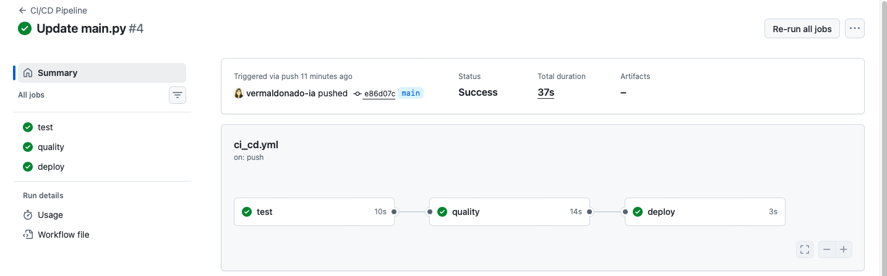

# 🚀 Cloud Delivery Pipeline Portafolio


# 🚀 Cloud Delivery Pipeline Portafolio


Repositorio que demuestra la implementación de un **pipeline CI/CD completo** utilizando **GitHub Actions**, incorporando validación automática de calidad de código y control de despliegue mediante un **Quality Gate simulado**.

---

## 🎯 Objetivo

Construir un pipeline que permita:

* Validar automáticamente la calidad del código
* Detectar errores de forma temprana
* Bloquear despliegues si no se cumplen estándares
* Simular un flujo CI/CD utilizado en entornos empresariales

---

## ⚙️ Arquitectura del Pipeline

El pipeline está compuesto por tres etapas principales:

```text
Push
 ↓
CI (Tests)
 ↓
Quality Gate (flake8)
 ↓
CD (Deploy simulado)
```

### 🔹 1. Integración Continua (CI)

* Instalación de dependencias
* Validación de entorno Python
* Ejecución de pruebas automatizadas con `pytest`

### 🔹 2. Code Quality - Quality Gate Simulado

Se implementa una etapa de validación de calidad usando `flake8`, que actúa como un **Quality Gate**.

Esta etapa valida:

* Errores críticos de código
* Variables no definidas
* Complejidad excesiva
* Estándares de formato

👉 Si esta etapa falla, el pipeline se detiene automáticamente.

### 🔹 3. Continuous Deployment (CD) Simulado

* Simulación de despliegue controlado
* Solo se ejecuta si CI y Quality pasan correctamente

---

## 🚫 Quality Gate en acción

Se realizaron pruebas controladas para validar el comportamiento del pipeline.

---

### ❌ Caso 1: Falla de calidad

Se introdujo intencionalmente un error en el código (`variable no definida`), provocando:

* Fallo en la etapa de calidad (`flake8`)
* Bloqueo del pipeline completo
* Cancelación automática del despliegue

#### 📸 Evidencia


---

### ✅ Caso 2: Código corregido

Tras corregir el error:

* Tests ejecutados correctamente
* Validación de calidad aprobada
* Despliegue simulado ejecutado

#### 📸 Evidencia



---

## 🎯 Resultado

El pipeline implementa correctamente un **Quality Gate**:

* Si la calidad falla → el despliegue NO ocurre
* Si la calidad pasa → el pipeline continúa

---

## 🧠 Enfoque técnico

Esta implementación replica el comportamiento de pipelines empresariales donde:

* La calidad del código es obligatoria antes del despliegue
* Se aplican controles automatizados de validación
* Se previenen errores en producción

El Quality Gate simulado representa el rol que cumplen herramientas como **SonarQube** en entornos reales.

---

## 🚀 Valor del Portafolio

Este proyecto demuestra:

* Implementación de CI/CD con GitHub Actions
* Integración de validación de calidad automatizada
* Control de flujo mediante dependencias entre jobs (`needs`)
* Simulación de despliegue condicionado por calidad
* Enfoque DevOps orientado a calidad y confiabilidad

---

## 📁 Estructura del Proyecto

```text
cloud-delivery-pipeline-portafolio/
├── .github/workflows/
│   ├── ci.yml
│   └── ci_cd.yml
├── app_demo/
│   ├── src/
│   ├── tests/
│   └── requirements.txt
├── docs/
│   ├── quality-gate-fail.png
│   └── quality-gate-success.png
└── README.md
```

---

## 🧩 Próximos pasos

* Integración con SonarQube real
* Implementación de despliegue real (AWS / Azure)
* Gestión de artefactos
* Pipeline multi-entorno (dev / qa / prod)

---

## 💬 Contexto profesional

Este pipeline fue diseñado como parte de un portafolio orientado a roles como:

* Cloud & DevOps Delivery Manager
* Cloud Project Manager
* Platform Delivery Manager

---

## 🏁 Conclusión

Se logra implementar un pipeline CI/CD completo con control de calidad automatizado, demostrando cómo prevenir despliegues de código defectuoso y asegurar estándares mínimos antes de liberar cambios.

---
