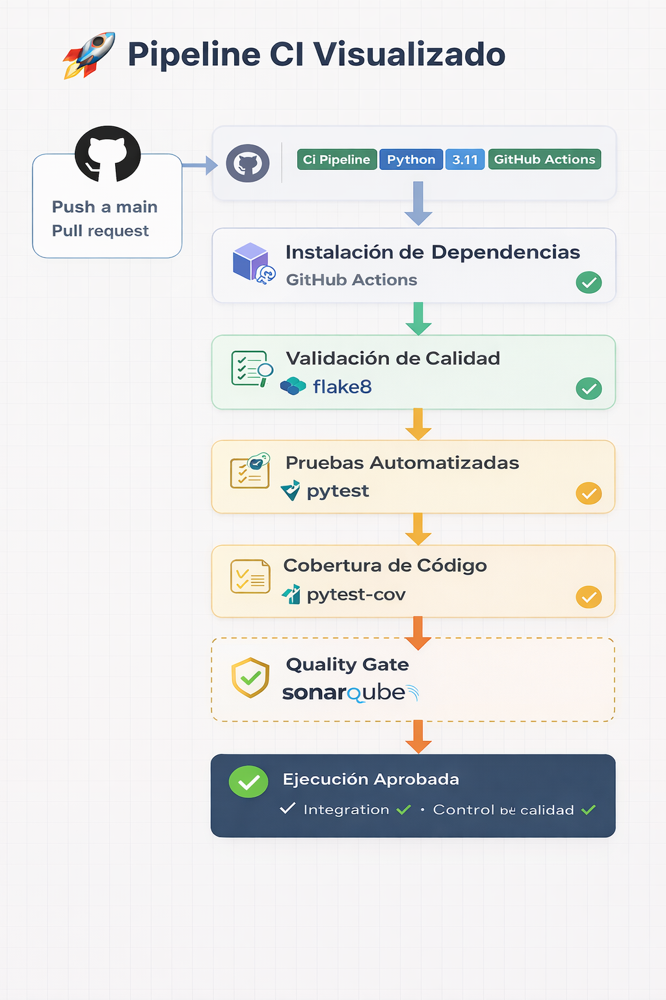

# 🚀 Cloud Delivery Pipeline Portafolio

Repositorio orientado a demostrar la implementación de un **pipeline de Integración Continua (CI)** y bases de **Continuous Delivery/Deployment (CD)** utilizando **GitHub Actions**, con foco en calidad de código, pruebas automatizadas y control de cobertura.

---

## 🎯 Objetivo

Construir un portafolio práctico que evidencie la implementación de un pipeline moderno de entrega de software, permitiendo:

* Validar calidad de código automáticamente
* Detectar errores tempranamente
* Ejecutar pruebas automatizadas en cada cambio
* Exigir cobertura mínima antes de integrar cambios
* Establecer un **Quality Gate** dentro del pipeline
* Sentar bases para evolucionar hacia un flujo CI/CD más completo

---

## 🧩 Alcance del repositorio

Este repositorio representa una implementación progresiva de prácticas DevOps aplicadas a un proyecto demostrativo en Python.

Actualmente incluye:

* CI automatizado con GitHub Actions
* Linting y validación de calidad
* Pruebas automatizadas con pytest
* Control de cobertura
* Estructura preparada para Code Quality
* Base para despliegue continuo (CD)

---

## ⚙️ Pipeline implementado

El pipeline de CI se ejecuta automáticamente en:

* `push` a la rama principal
* `pull request`

Flujo de Integración Continua con validación de calidad y control de despliegue

### 🔄 Flujo del pipeline

Push / Pull Request
↓
Instalación de dependencias
↓
Validación de calidad
↓
Ejecución de pruebas
↓
Cobertura
↓
Quality Gate
↓
Resultado del pipeline

---

## 🛠️ Tecnologías utilizadas

* Python 3.11
* GitHub Actions
* Pytest
* Pytest-cov
* Flake8
* SonarQube (estructura preparada)

---

## 📁 Estructura del proyecto

cloud-delivery-pipeline-portafolio/
├── .github/workflows/
├── app_demo/
├── aws/
├── azure_devops/
├── docs/
├── sonarqube/
├── README.md
├── sonar-project.properties
└── trigger.txt

---

## ✅ Qué valida este pipeline

El pipeline asegura criterios mínimos de calidad antes de aceptar cambios:

* Instalación correcta de dependencias
* Ejecución sin errores
* Pruebas automatizadas exitosas
* Cobertura mínima requerida
* Consistencia del código

---

## 🧪 Evidencias del pipeline

### ✅ Pipeline exitoso

### ❌ Falla por pruebas

### ⚠️ Falla por cobertura

---

## 📌 Quality Gate

El pipeline incorpora controles que actúan como un **Quality Gate**, evitando integrar cambios que no cumplan condiciones mínimas.

Esto permite:

* Reducir defectos
* Detectar regresiones
* Mantener estándares de desarrollo
* Aumentar confiabilidad del delivery

---

## 🔍 Code Quality

El repositorio incluye un módulo `sonarqube/` orientado a:

* Mantenibilidad
* Validación técnica del código
* Evolución hacia análisis avanzado

📎 Ver detalle en:
sonarqube/README.md

---

## 🚀 Valor del proyecto

Este repositorio demuestra:

* Integración Continua real
* Automatización de validaciones
* Control de calidad en el ciclo de desarrollo
* Uso práctico de GitHub Actions
* Diseño de pipelines confiables

---

## 📈 Próximos pasos

* Incorporar despliegue (CD) más robusto
* Aumentar validaciones de calidad
* Expandir el proyecto demo
* Integrar análisis real con SonarQube

---

## 👩‍💻 Autora

**Verónica Maldonado Céspedes**
Ingeniera Civil Informática
Project Manager | Scrum Master | Cloud & DevOps Delivery Manager

---

## ⭐ Nota final

Este repositorio demuestra una implementación práctica de controles de calidad dentro de un pipeline automatizado, sentando bases sólidas para evolucionar hacia prácticas DevOps más avanzadas.
test ruleset
